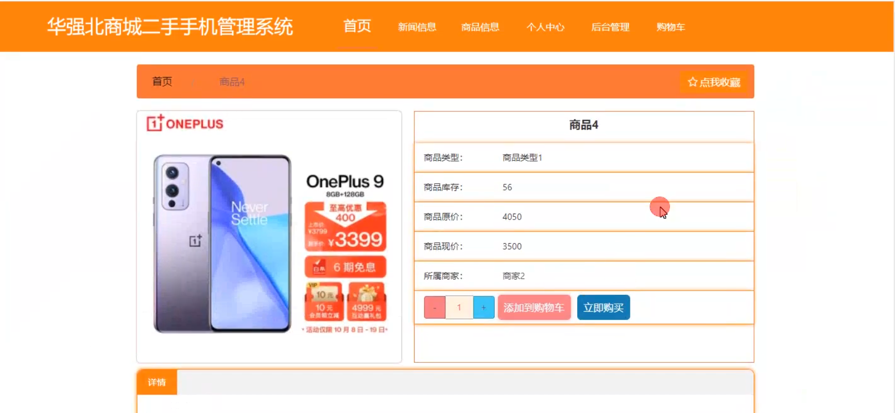

# 基于springboot的华强北商城二手手机管理系统

<h4 style='color:red'>联系不到我，就看我的主页 </h4> 
 
#### 介绍

随着二手手机市场的不断发展，为了实现对华强北商城二手手机交易的有效管理和规范运作，我们开发了这套基于 Spring Boot 的二手手机管理系统。该系统旨在为管理端、商家端和用户端提供便捷、高效的服务，促进二手手机交易的顺利进行。

#### 技术栈

后端技术栈：Springboot+Mysql+Maven

前端技术栈：Vue+Html+Css+Javascript+ElementUI

开发工具：Idea+Vscode+Navicate

#### 系统功能介绍

（一）管理端    
个人中心：管理端人员可以在此查看和修改个人信息，接收系统重要通知和消息。  
管理员管理：对其他管理员的账号进行创建、权限分配、修改和删除等操作，确保管理团队的合理配置。  
商家管理：审核商家的入驻申请，监督商家的经营活动，对违规商家进行处理。  
用户管理：管理用户的注册信息，处理用户的投诉和建议，保障用户的合法权益。  
商品信息管理：审核和发布二手手机的商品信息，包括手机的型号、配置、成色、价格等详细描述，确保商品信息的准确性和真实性。  
商品信息收藏管理：查看用户对商品信息的收藏情况，分析热门商品和用户偏好。  
商品信息订单管理：处理二手手机的订单，包括订单确认、发货安排、退款处理等，保障交易流程的顺利进行。  
基础数据管理：维护系统中的基础数据，如手机品牌、型号、配置参数等，为商品信息管理提供数据支持。  
新闻信息管理：发布与二手手机市场、行业动态、商城活动相关的新闻信息，吸引用户关注。  

（二）商家端  
新闻信息：及时了解行业动态和商城发布的新闻，以便调整经营策略。  
商品信息：发布和管理二手手机的商品详情，包括上传图片、填写描述、设置价格和库存等。  
个人中心：修改商家的基本信息，查看交易记录和经营数据统计。  
后台管理  
商品信息管理：对已发布的商品信息进行修改、下架等操作，实时更新商品状态。  
商品信息订单管理：处理来自用户的订单，与用户沟通交易细节，安排发货等事宜。  
新闻信息管理：发布商家自己的促销活动、优惠信息等新闻，吸引用户购买。  
购物车：方便商家查看用户添加到购物车但未下单的商品，进行针对性的营销活动。  

（三）用户端  
新闻信息：获取二手手机行业的最新资讯、商城的优惠活动等信息。  
商品信息：浏览商城内的二手手机商品，查看详细参数和图片，进行比较和筛选。  
个人中心：修改个人资料，查看订单记录、收藏的商品和购物车等。  
后台管理：对个人的购物相关信息进行管理和操作。  
购物车：将心仪的二手手机商品添加到购物车，方便统一结算和购买。  

#### 系统作用

华强北商城二手手机管理系统的主要作用包括：  

促进二手手机交易： 提供一个集中和便捷的平台，帮助商家和用户进行二手手机的交易。  
提升用户体验： 通过丰富的功能模块，让用户能够轻松浏览商品、添加购物车并下单购买。  
高效管理： 管理员通过后台系统可以高效管理商家、用户、商品、订单和新闻信息，确保商城的顺利运营。  
信息传递： 通过新闻信息和轮播图管理，管理员可以及时向用户和商家传递最新的系统信息和行业资讯。  

#### 系统功能截图

代码结构

数据库表

登录

前台页面首页

商品信息

购物车

个人中心

商品信息订单管理

商家端商品信息

个人中心的订单管理

#### 总结

基于 Spring Boot 的华强北商城二手手机管理系统通过明确的角色划分和丰富的功能模块，实现了对二手手机交易的全面管理和优化。管理端能够有效监管市场，商家端能够便捷经营，用户端能够轻松购物。这一系统有助于推动华强北商城二手手机市场的健康发展，提升交易的效率和质量。未来，我们将持续改进和完善系统，以适应不断变化的市场需求和技术发展。

#### 使用说明

创建数据库，执行数据库脚本 修改jdbc数据库连接参数 下载安装maven依赖jar 启动idea中的springboot项目

前台登录页面
http://localhost:8080/huaqiangbeiershoushojiushangcheng/front/index.html

后台登录页面
http://localhost:8080/huaqiangbeiershoushojiushangcheng/admin/dist/index.html

管理员 			账户:admin 		密码：admin
